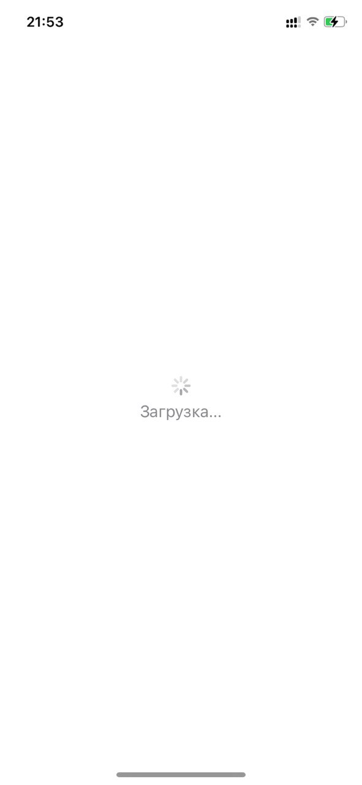
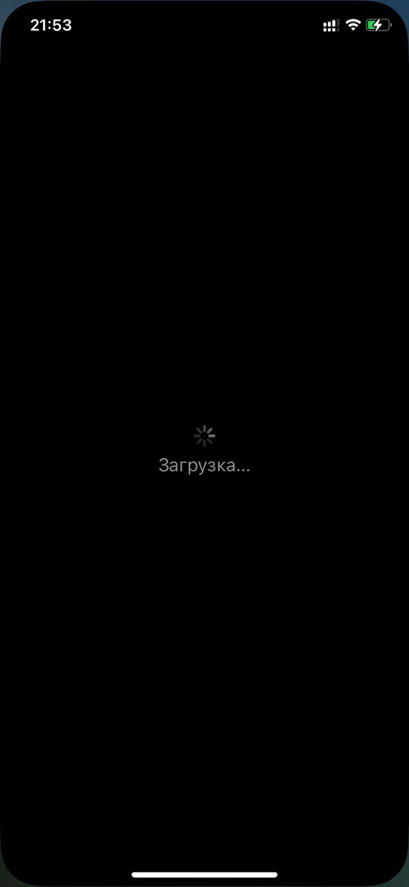
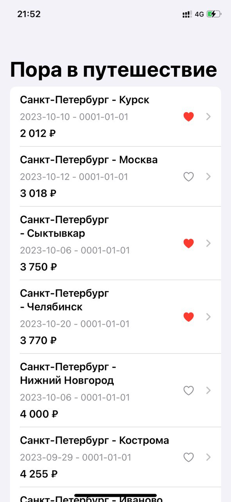
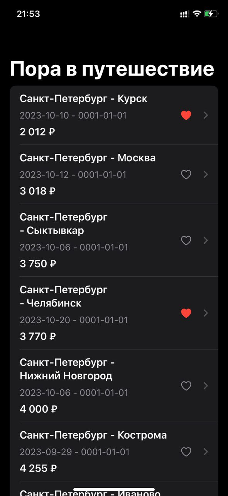
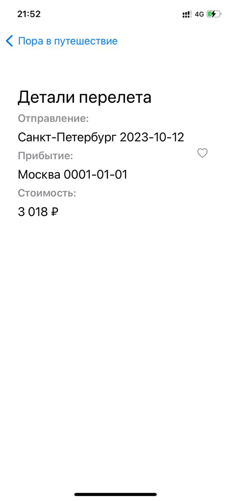
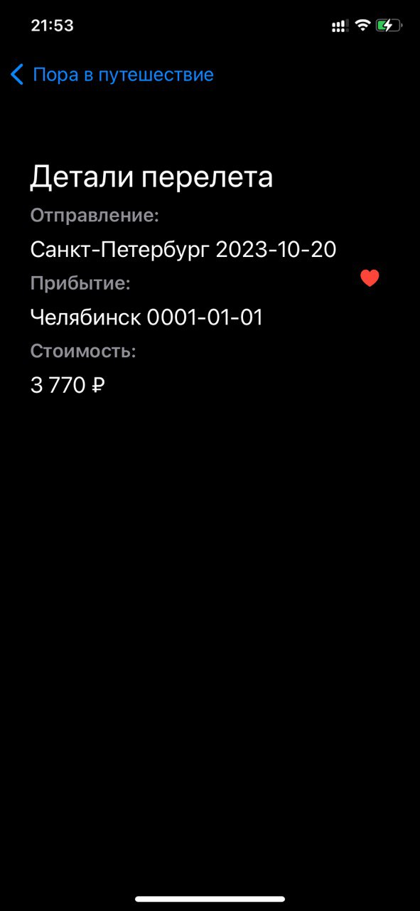

# wb-test
## Общее описание задания:
Задача
Нужно создать мобильное приложение “Пора в путешествие” с двумя
экранами.

### Первый экран

Первый экран представляет из себя список актуальных дешевых
авиаперелетов.

Каждая ячейка списка должна содержать:
1. Город отправления.
2. Город прибытия.
3. Дата отправления.
4. Дата возвращения.
5. Цена в рублях.
6. Иконка “Лайк” (имеет два состояния и означает лайкнул ли
пользователь данный авиаперелет).

### Второй экран

Второй экран - это детализация перелета с кнопкой “Лайк”.
Второй экран открывается при выборе одной из ячеек первого экрана.
Должна быть возможность вернуться к первому экрану назад.
Второй экран содержит данные по выбранному перелету (город
отправления, город прибытия, дата отправления, дата возвращения,
цена в рублях) и кнопку “Лайк”.

### Кнопка лайк имеет два состояния:
1. Перелет нравится.
2. Перелет не нравится.
Примечания
1. Дизайн произвольный, на усмотрение разработчика.
2. Список авиаперелетов запрашивается один раз при старте
приложения.
3. Пока происходит загрузка списка должен быть отображен
индикатор загрузки.
4. Если пользователь лайкнул перелет и вернулся в список
перелетов, то в списке у “лайкнутого” перелета должна “гореть”
иконка “Лайк”.
5. Если пользователь “лайкнул” перелет, вышел на первый экран и
еще раз зашел на второй экран, то кнопка “Лайк” должна быть в
состоянии “Перелет нравится” и наоборот.

## Реализация
Верстка: SwiftUI

## Интерфейс пользователя 
#### Экран загрузки 
 | 
#### Первый экран
 | 
#### Второй экран
 | 

## Демонстрация работы приложения: 
[https://drive.google.com/drive/folders/1EaI11hdJmsq_TeVB2WZ7kFP0ClzJDpln?usp=sharing](https://drive.google.com/drive/folders/1IXHHiteLPAC__nzqVCGJU2nqW1KyXNMa?usp=sharing)
## Инструкция по запуску проекта
Эта инструкция покажет вам, как локально запустить проект на вашем компьютере.

### Предварительные требования
Прежде чем начать, убедитесь, что у вас установлены следующие инструменты:

Xcode: Для разработки iOS-приложений вам понадобится Xcode. Вы можете скачать его с официального сайта Apple.
### Шаги по установке
1. Клонирование репозитория: Откройте терминал и выполните следующую команду, чтобы склонировать репозиторий на ваш компьютер:
``gh repo clone AnastasiaZdobnova/wb-test``
2. Открытие проекта: Перейдите в папку проекта и дважды кликните на файл проекта с расширением .xcodeproj, чтобы открыть проект в Xcode.

3. Запуск симулятора: В Xcode выберите целевое устройство (симулятор или физическое устройство), нажмите кнопку "Build and Run" (или Cmd+R), чтобы скомпилировать и запустить приложение. Убедитесь, что открыта ветка main.

Готово!
После выполнения этих шагов, вы должны увидеть запущенное приложение на симуляторе или физическом устройстве, в зависимости от вашего выбора.

Теперь вы можете начать работать с приложением и изучать его функциональность.

Удачи!
